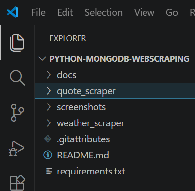
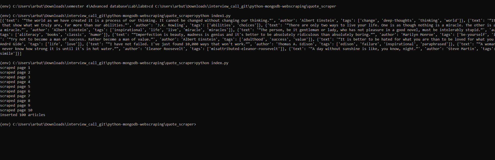
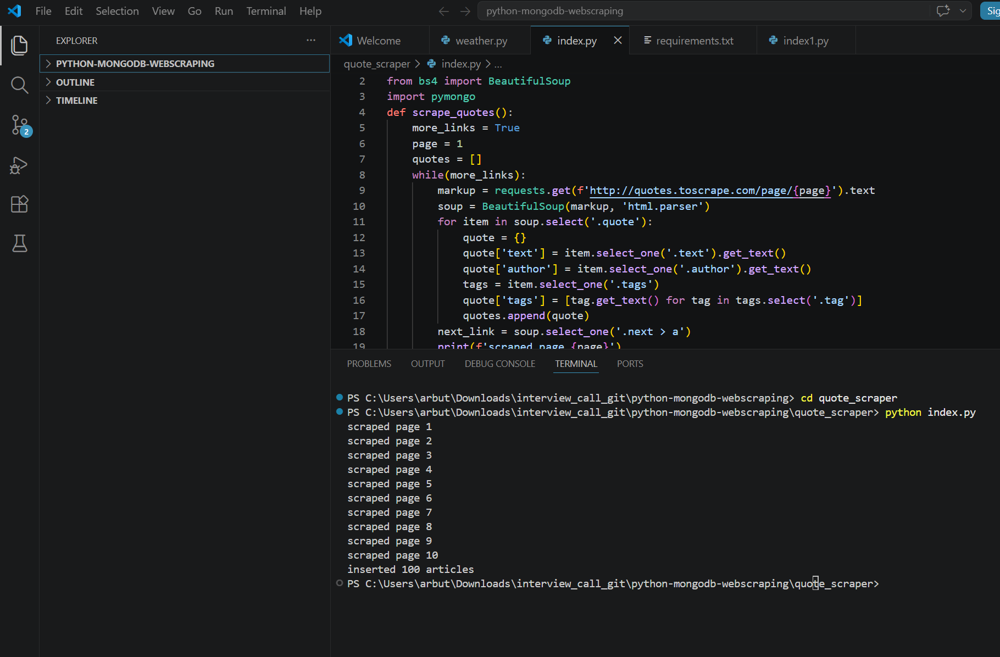
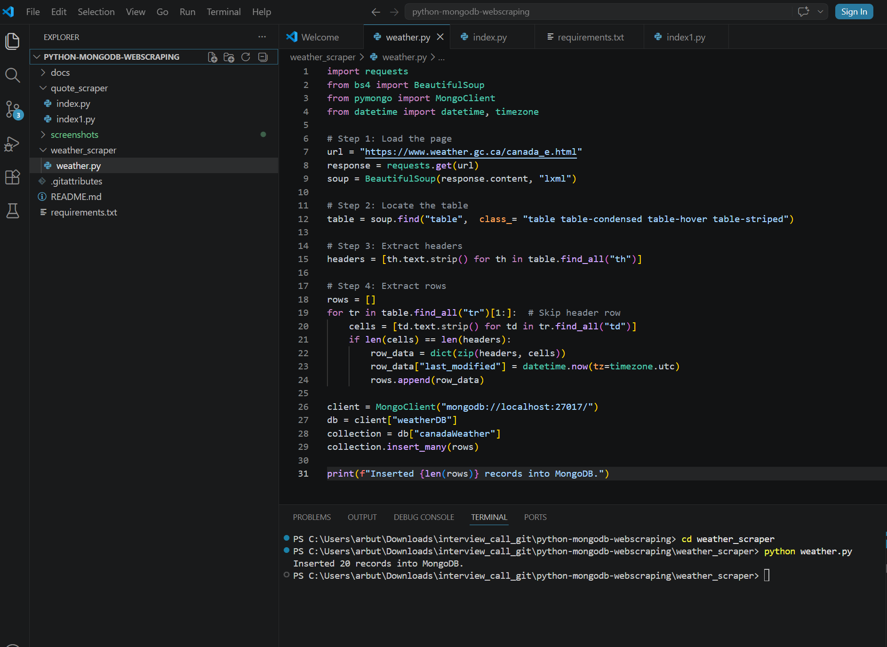
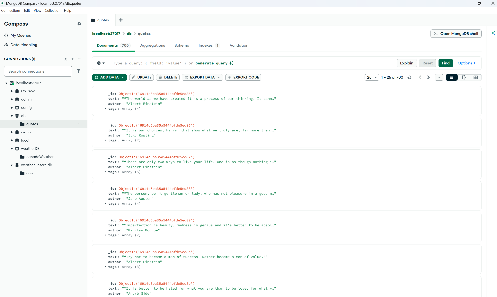
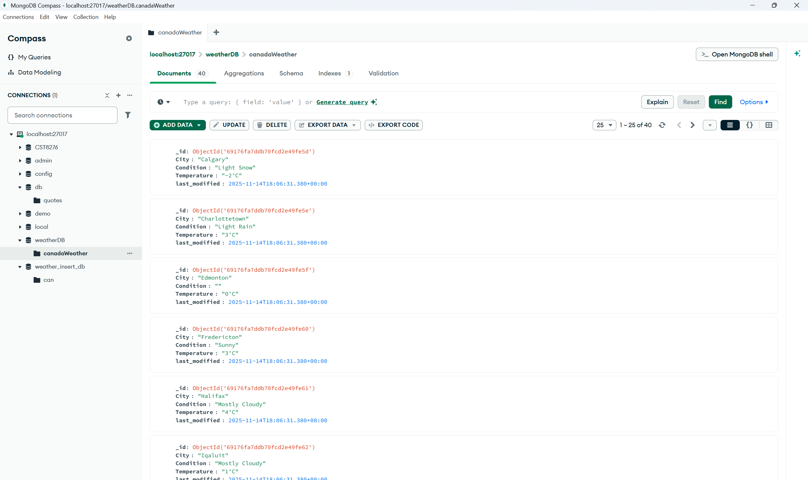

# Python MongoDB Web Scraping Application

## Overview
This project demonstrates how to use Python with MongoDB to collect, process, and store web data using BeautifulSoup and PyMongo.

The application performs:
- Web scraping from public websites
- Data extraction and processing
- MongoDB database insertion
- Weather data collection and storage

---

## Features
- Quote scraping using BeautifulSoup
- Multi-page data collection
- MongoDB integration using PyMongo
- Weather table scraping
- Data storage verification using MongoDB Compass

---

## Technologies Used
- Python
- MongoDB
- PyMongo
- BeautifulSoup4
- lxml
- Requests

---

## Project Structure



---

## Application Execution

### Quote Scraper Output


### MongoDB Insert Output


### Weather Scraper Output


---

## MongoDB Results

### Quotes Collection


### Weather Collection


---

## How to Run

### Install Dependencies

```bash
pip install -r requirements.txt

### Run Quote Scraper

python quote_scraper/index.py

### Run Weather Scraper

python weather_scraper/weather.py

## Author
Arbutha Durairaj
